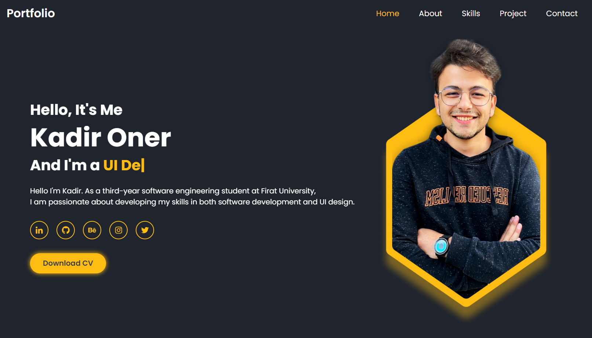

# Portfolio Websitesi

Bu benim kişisel portfolio websitesi. Bu website ile benim hakkımda daha fazla bilgi edinebilir, projelerime göz atabilir ve benimle iletişime geçebilirsiniz. Bu proje HTML, CSS ve JavaScript kullanılarak geliştirilmiştir.

## Nasıl Kurulur ve Kullanılır

Bu projeyi yerel bilgisayarınızda kullanmak için aşağıdaki adımları takip edin:

1. Proje dosyalarınızı bilgisayarınıza indirin.
2. İndirilen dosyaları bir klasöre çıkartın.
3. Klasörde bulunan index.html dosyasını tarayıcınızda açın.

## Özellikler

Bu portfolio websitesinde aşağıdaki özellikler bulunmaktadır:

- Anasayfa: Kendim hakkında bilgi veren bir sayfa.
- Projeler: Daha önce geliştirdiğim projeleri listeleme ve detaylı olarak inceleme imkanı sağlayan bir sayfa.
- İletişim: İletişim formu sayfası.

## Ekran Görüntüleri

## Katkıda Bulunma

Bu projeye katkıda bulunmak isterseniz, lütfen bir pull request açarak önerilerinizi gönderin. Herhangi bir hata bulursanız veya projede herhangi bir iyileştirme yapmak isterseniz, lütfen bir konu açın.

## Youtube'da izle

https://www.youtube.com/watch?v=Tkp3FDgOueM&t=2765s
